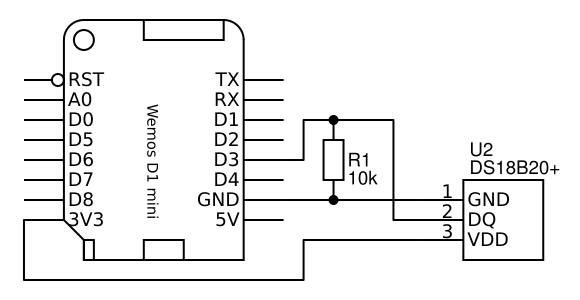

# Thermometer
A thermometer which will read and publish the temperature to a MQTT topic on a set interval.

## Hardware
- [Lolin (Wemos) D1 Mini](https://wiki.wemos.cc/products:d1:d1_mini)
- [DS18B20+](https://datasheets.maximintegrated.com/en/ds/DS18B20.pdf)
- USB (phone) charger (max 5V)

The electronic circuit is shown in the diagram below:

## Software
Source file is available at [thermometer.ino](thermometer.ino) and is self-explanatory.