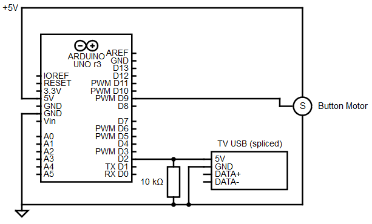
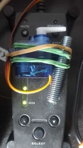

# Turn On/Off Sound System When The TV Is Turned On/Off
Due to a constant low buzzing of my sound system, I want to turn it off when it's not in use.

Using an Arduino, the USB port of the TV will be monitored and in the event of a voltage change (i.e. TV is turned on/off) a motor will press the power switch on the sound system.

## Hardware
- Arduino Uno
- Spliced USB cable (only power cables)
- SG90 servo motor
- Rubber bands (or equivalent way to attach the motor to the button)

Below is the circuit diagram for the setup:

The servo motor is attached with rubber bands to the sound system control unit so as to allow it to push the button:

## Software
Source code for the Arduino can be found in [tv-sound-control.ino](tv-sound-control.ino).
